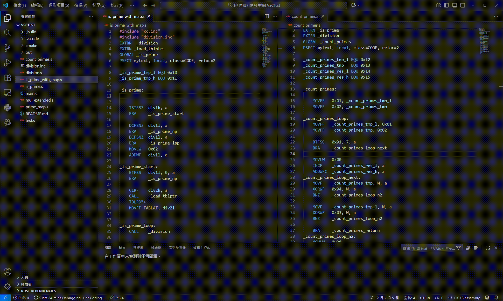

# PIC18 Assembly Language
為 Visual Studio Code 提供簡易的 PIC18 系列組合語言支持。

Provides basic PIC18 assembly language support for Visual Studio Code.



## 目錄 (Contents)
- [特色 (Features)](#特色-features)
- [已知問題 (Known Issues)](#已知問題-known-issues)
- [代辦事項](#代辦事項-todo)
- [功能演示 (Demo)](#功能演示-demo)
- [更新日誌 (Changelog)](#更新日誌-changelog)

## 特色 (Features)
- 指令 Instruction
    - 內嵌文檔 (Inline documentation)
    - 自動補全 (Auto completion)
    - 參數提示 (Parameter hints)
    - 語法上色 (Syntax highlighting)

- 標籤 Label
    - 自動補全 (Auto completion)
    - 自動插入 EXTRN (Auto insert EXTRN)
    - 跨檔索引 (Cross-file indexing)
    - 跳至定義 (Go to Definition)
    - 語意標記 (Semantic tokens)
    - 衝突偵測 (Conflict diagnostics)
    - 自訂註解 (Custom comments)

- 變數(EQU) Variable
    - 自動補全 (Auto completion)
    - 跨檔索引 (Cross-file indexing)
    - 跳至定義 (Go to Definition)
    - 語意標記 (Semantic tokens)
    - 自訂註解 (Custom comments)

- 內部暫存器 Special Function Register
    - 自動補全 (Auto completion)
    - 語法上色 (Syntax highlighting)

## 已知問題 (Known Issues)
- Macro 無法正常識別 (Macro definitions are not recognized)

## 代辦事項 (Todo)
- 支援 Macro 定義 (Support Macro definitions)

## 功能演示 (Demo)


## 更新日誌 (Changelog)
#### 2025-10-19
```
- v0.1.1 發布
```
