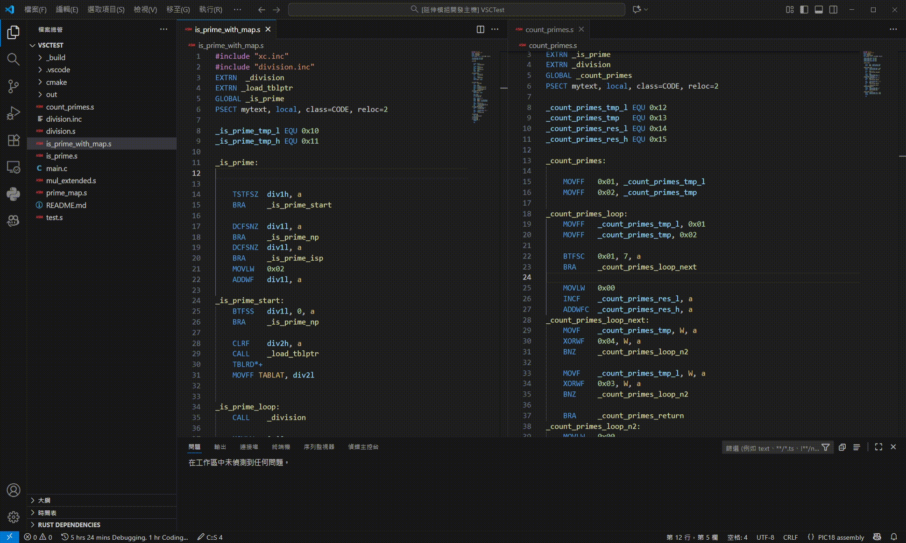

# PIC18 Assembly Language Extension
為 Visual Studio Code 提供簡易的 PIC18 系列組合語言支持。

Provides basic PIC18 assembly language support for Visual Studio Code.



## 如何安裝
既然你都已經打開 Github 了，能不能順便幫我點一下右上角的星星 :face_holding_back_tears:


### 注意事項
這個擴充功能並不包含編譯及偵錯功能，僅提供語法高亮、指令說明、標籤與變數的自動補全等功能。

你可以在 VSCode 中編輯完後，在使用 MPLAB X IDE 或其他工具來編譯與偵錯你的程式碼。

### 從 Visual Studio Code 市集安裝
1. 開啟 Visual Studio Code
2. 點選左側的 Extensions 圖示
3. 在搜尋欄輸入 "PIC18 Assembly Language"
4. 找到 "PIC18 Assembly Language" 擴充功能，點選 "Install" 按鈕

    **請確認發布者為 `ChuangChih-Hao` 或是頁面右側的識別碼為 `zhihao1021.pic18-assembly-language`**

<!-- ### 使用 VSIX 檔案安裝
1. 前往 [Visual Studio Code 市集頁面](https://marketplace.visualstudio.com/items?itemName=zhihao1021.pic18-assembly-language)
2. 點選 "Download Extension" 下載 VSIX 檔案
3. 開啟 Visual Studio
4. 點選左側的 Extensions 圖示
5. 點選右上角的三個點，選擇 "Install from VSIX..."
6. 選擇剛剛下載的 VSIX 檔案 -->

## 開發
### 環境建置
```bash
npm install
```

### 編譯
```bash
npm run compile   # 檢查型別與編譯錯誤
npm run bundle    # 產生 out/extension.js
```

### 發布
```bash
vsce package
```

## 授權

MIT License

Copyright (c) 2025 CHIH-HAO CHUANG

Permission is hereby granted, free of charge, to any person obtaining a copy
of this software and associated documentation files (the "Software"), to deal
in the Software without restriction, including without limitation the rights
to use, copy, modify, merge, publish, distribute, sublicense, and/or sell
copies of the Software, and to permit persons to whom the Software is
furnished to do so, subject to the following conditions:

The above copyright notice and this permission notice shall be included in all
copies or substantial portions of the Software.

THE SOFTWARE IS PROVIDED "AS IS", WITHOUT WARRANTY OF ANY KIND, EXPRESS OR
IMPLIED, INCLUDING BUT NOT LIMITED TO THE WARRANTIES OF MERCHANTABILITY,
FITNESS FOR A PARTICULAR PURPOSE AND NONINFRINGEMENT. IN NO EVENT SHALL THE
AUTHORS OR COPYRIGHT HOLDERS BE LIABLE FOR ANY CLAIM, DAMAGES OR OTHER
LIABILITY, WHETHER IN AN ACTION OF CONTRACT, TORT OR OTHERWISE, ARISING FROM,
OUT OF OR IN CONNECTION WITH THE SOFTWARE OR THE USE OR OTHER DEALINGS IN THE
SOFTWARE.
